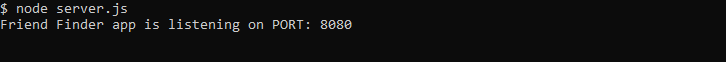

# FriendFinder
GW Homework #13

The Friend Finder add (essentially a dating app but for friends) implements friend matching based on the user's responses to a ten question survey. The user responds to questions with values from 1 (Strongly Disagree) to 5 (Strongly Agree). When the survey is submitted, an existing user record with the closest data to the current user's responses is found and returned. The closest set of user responses is defined as the set with the lowest absolute difference for all ten questions combined.

The application is implemented using a Nodeand Express servers.

<h2>Demo</h2>
<i>Friend Finder</i> is deployed to Heroku. Please check it out <a href="https://friend-finder13.herokuapp.com/">here</a>.

<h2>Installation</h2>
To install the application follow the instructions below:

<ol>
    <li>git clone git@github.com:valfragier16/FriendFinder.git</li>
    <li>cd FriendFinder</li>
    <li>npm install</li>
</ol>

<h2>Run Locally</h2>
Once you have completed installation, to access the application in your browser, first run <i>node server.js</i> in your terminal within the <i>FriendFinder</i> folder.

If done properly, your terminmal should display the following:

The application will now be running locally on PORT, in this case that is port 8080. You can then access it locally from your browser at the URL localhost:PORT, in this case <i>localhost:8080</i>.